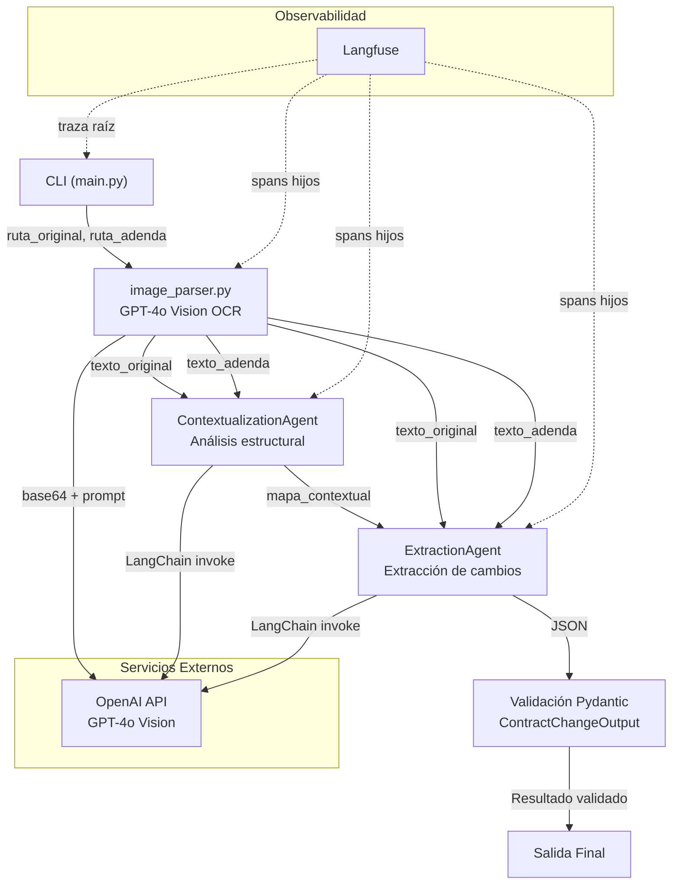

# Contract Addendum Analyzer

Sistema automatizado de análisis de contratos legales que compara un contrato original con su adenda para identificar, clasificar y describir los cambios introducidos. Utiliza agentes de IA colaborativos orquestados con LangChain, parsing multimodal con GPT-4o Vision, validación con Pydantic y trazabilidad completa con Langfuse.

## Arquitectura



## Flujo del Pipeline

El pipeline ejecuta las siguientes etapas de forma **secuencial**:

1. **Parsing de imágenes** — `image_parser.py` recibe las rutas de las dos imágenes (contrato original y adenda), las codifica en base64 y las envía a la API de GPT-4o Vision con un prompt especializado para extraer el texto completo respetando la estructura, jerarquía de secciones y numeración de cláusulas del documento.

2. **Agente de Contextualización** — `ContextualizationAgent` recibe ambos textos extraídos y produce un mapa contextual comparativo. Identifica las secciones presentes en cada documento, establece correspondencias entre ellas y describe el propósito de cada bloque. Este agente **no extrae cambios**, solo mapea la estructura.

3. **Agente de Extracción** — `ExtractionAgent` recibe el mapa contextual junto con ambos textos y analiza las diferencias. Identifica cada cambio introducido por la adenda, lo clasifica como "adición", "eliminación" o "modificación", y describe la sección afectada con el contenido original y nuevo. Produce una salida en formato JSON.

4. **Validación Pydantic** — La salida JSON del agente de extracción se valida contra el modelo `ContractChangeOutput`, que exige tres campos: `sections_changed` (secciones modificadas), `topics_touched` (temas legales afectados) y `summary_of_the_change` (resumen detallado de los cambios).

5. **Observabilidad** — Todo el pipeline está instrumentado con Langfuse. Se crea un span raíz `contract-analysis` con cuatro spans hijos (`parse_original_contract`, `parse_amendment_contract`, `contextualization_agent`, `extraction_agent`), registrando entradas, salidas, latencia y metadatos en cada etapa.

## Configuración

### 1. Clonar el repositorio

```bash
git clone <url-del-repositorio>
cd contract-addendum-analyzer
```

### 2. Instalar dependencias

```bash
pip install -r requirements.txt
```

### 3. Configurar variables de entorno

```bash
cp .env.example .env
```

Editar `.env` con las claves correspondientes:

| Variable | Descripción |
|----------|-------------|
| `OPENAI_API_KEY` | Clave de API de OpenAI |
| `LANGFUSE_PUBLIC_KEY` | Clave pública de Langfuse |
| `LANGFUSE_SECRET_KEY` | Clave secreta de Langfuse |
| `LANGFUSE_HOST` | Host de Langfuse (por defecto `https://cloud.langfuse.com`) |

## Ejecución

```bash
python -m src.main <ruta_contrato_original> <ruta_adenda>
```

### Ejemplo con contratos de prueba

```bash
python -m src.main data/test_contracts/par1_original.png data/test_contracts/par1_adenda.png
```

```bash
python -m src.main data/test_contracts/par2_original.png data/test_contracts/par2_adenda.png
```

La salida es un JSON validado con la estructura `ContractChangeOutput`:

```json
{
  "sections_changed": ["Cláusula 3 - Monto", "Cláusula 7 - Vigencia"],
  "topics_touched": ["Condiciones económicas", "Plazo contractual"],
  "summary_of_the_change": "La adenda modifica el monto mensual y extiende la vigencia..."
}
```

## Decisiones Técnicas

| Decisión | Justificación |
|----------|---------------|
| Pipeline secuencial (no paralelo) | El agente de extracción depende del mapa contextual producido por el agente de contextualización. La simplicidad secuencial es preferible para un MVP. |
| LangChain para agentes | Proporciona abstracciones para system prompts, invocación de LLMs y composición de cadenas. Simplifica la integración con OpenAI. |
| Pydantic para validación | Garantiza tipado estricto y validación automática del JSON de salida. Soporta serialización/deserialización con `model_validate()`. |
| Langfuse para observabilidad | Plataforma especializada en observabilidad de LLMs con soporte nativo para spans jerárquicos, latencia y tokens. |
| GPT-4o Vision para OCR | Capacidad multimodal que permite extraer texto estructurado de imágenes sin necesidad de un motor OCR separado. |

## Estructura del Proyecto

```
├── src/
│   ├── main.py                          # Punto de entrada CLI y orquestación
│   ├── image_parser.py                  # Parsing de imágenes con GPT-4o Vision
│   ├── models.py                        # Modelo Pydantic ContractChangeOutput
│   └── agents/
│       ├── contextualization_agent.py   # Agente de contextualización
│       └── extraction_agent.py          # Agente de extracción
├── data/
│   └── test_contracts/                  # Contratos de prueba
│       ├── README.md                    # Descripción de los pares de prueba
│       ├── par1_original.png            # Par 1: contrato de servicios
│       ├── par1_adenda.png              # Par 1: adenda (cambios simples)
│       ├── par2_original.png            # Par 2: contrato de confidencialidad
│       └── par2_adenda.png              # Par 2: adenda (cambios complejos)
├── tests/                               # Tests unitarios, PBT y de integración
├── .env.example                         # Variables de entorno requeridas
├── requirements.txt                     # Dependencias con versiones fijadas
└── README.md                            # Este archivo
```

## Contratos de Prueba

El directorio `data/test_contracts/` contiene dos pares de contratos para validación:

- **Par 1 (cambios simples):** Contrato de servicios con adenda que modifica el monto mensual y la fecha de vencimiento (2 modificaciones).
- **Par 2 (cambios complejos):** Contrato de confidencialidad con adenda que añade una nueva cláusula, modifica el alcance territorial y elimina una restricción de uso (1 adición, 1 modificación, 1 eliminación).

Consultar `data/test_contracts/README.md` para más detalles sobre cada par y los resultados esperados.
